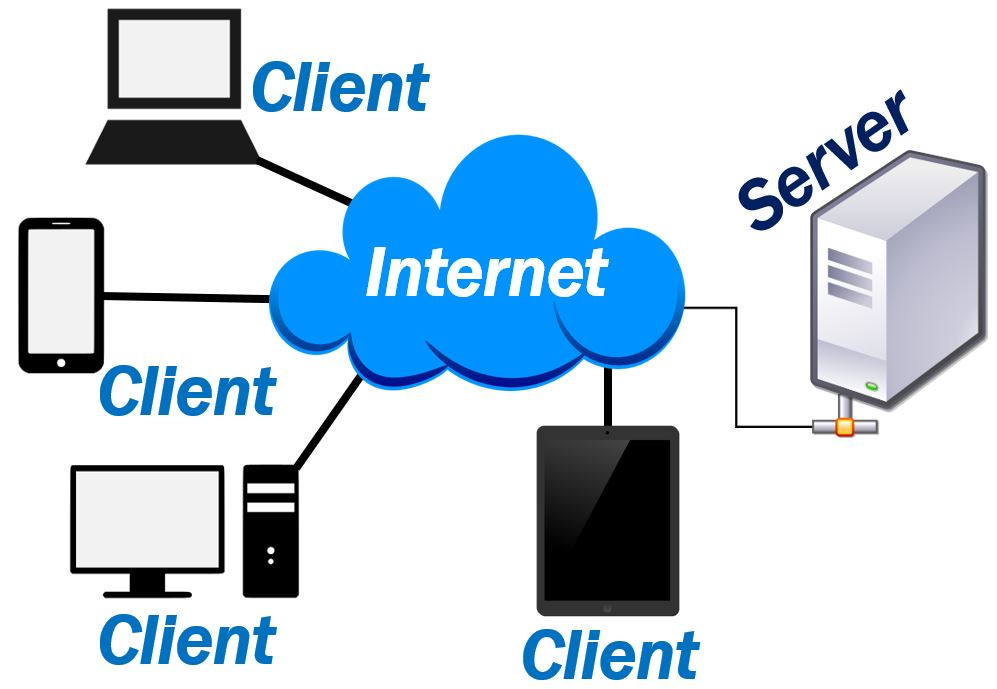
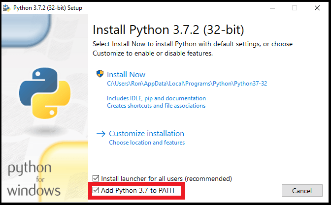

# Absolute Blind Beginner's Intro to Flask Web Apps   
_This tutorial was created to serve as an intro crash course to webapp development using a python webapp development framework called "[Flask](https://flask.palletsprojects.com/en/2.0.x/)". A "software framework" is basically working code that was developed by one or more programmers already that you can reference in your own code instead of "re-inventing the wheel". There are different types of frameworks, for example the CSS framework this intro will be using is "[Bootstrap](https://getbootstrap.com/)"_

**What is  a Web App?**   
A Web Application, or WebApp, is just an app that runs on a web server. A server is a computer (or program) that provides a service to other computers, referred to as "clients", with access to the same network.    

Example: Let's say there's a classroom with 1 teacher and 10 students. The teacher is the server, providing a service by teaching music. As long as the students are in the classroom (within the network) they can take part of the service that's offered by the teacher. If one of the students exits the classroom (network) he/she no longer engage with the teacher to learn. However, as soon as the student enters the classroom again he/she can no resume receiving the music lesson. 

If we were to expand on the classroom example, we can make the classroom larger and offer multiple services in the music class. Let's give the students instruments; half can play trumpets and the other half can play drums. That same teacher (server) can now offer two different services (webapps) to the different students (clients) based on their musical interest.

### System Requirements:
 * [Python 3](http://www.python.org/downloads/) or newer
    > NOTE : When installing on windows be sure to check the option
    to "Add Python [X.X] to Path"
    
 * [Gitbash](https://git-scm.com/downloads) **for windows users
 * Internet Connection
 * One of the following Code Editors/IDE's:
    * [VS Code](https://code.visualstudio.com/download) ** I will be using this
    * [PyCharm](https://www.jetbrains.com/pycharm/download/#section=windows)
    * [Sublime](https://www.sublimetext.com/download)
    * [Atom](https://atom.io/)
    > NOTE : IDE - Integrated Development Environment.

> NOTE : This webapp will work on linux, mac, & windows

### The following Topics will be covered:   
 * IDE vs Code Editors
    * Commenting Code
    * Naming Styles
    * Code structure 
 * HTML
 * CSS Frameworks [Bootstrap]
 * Reading/Understanding Code Documentation
 * Javascript
 * Database Basics [SQLAlchemy]
 * Git basics

### WebApp Goal:
Make a House Chores Management Webapp to track chores in an imaginary home of 4: Mom, Dad, daughter, & son. 

### WebApp Requirements:   
 * 1 base format
 * 3 different views
    * Main View - Weekly Dashboard
    * Management View - Adding/Removing family members names/chores types
    * Assignment View - Date, chore, & asignee selection, or assignment removal
 * 1 menu bar to navigate to the different views
 * Should be able to add/remove family members 
 * Should be able to add/remove chores
 * Chores should have two states: Completed & Not Completed
 * Chores should include a name, family member owner, time, date, and completed state
 * The main view should be a week view, and users should be able to view all previous weeks
 * Once a week has ended, chore completion status cannot change
 * The history of the chores should be stored in a database (db)